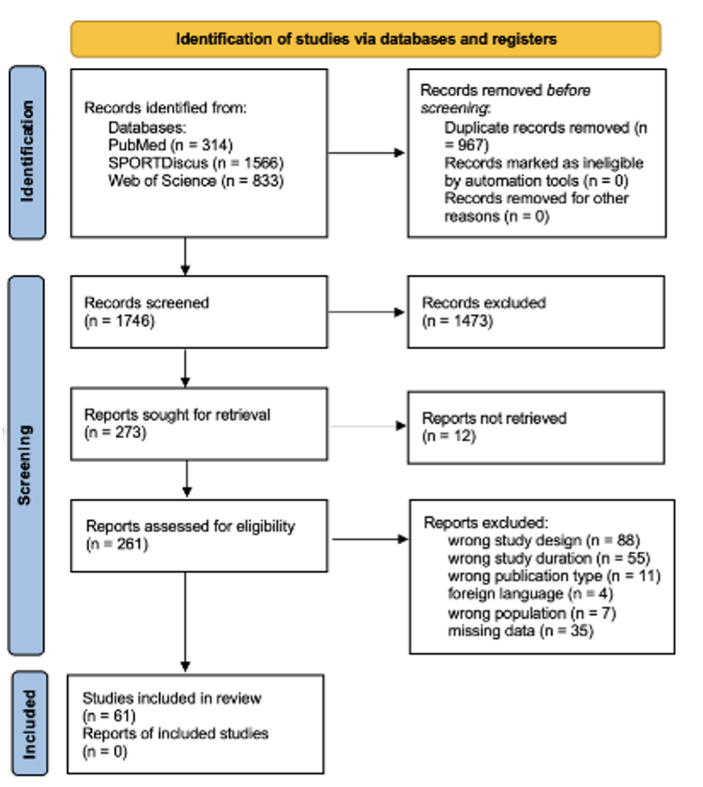
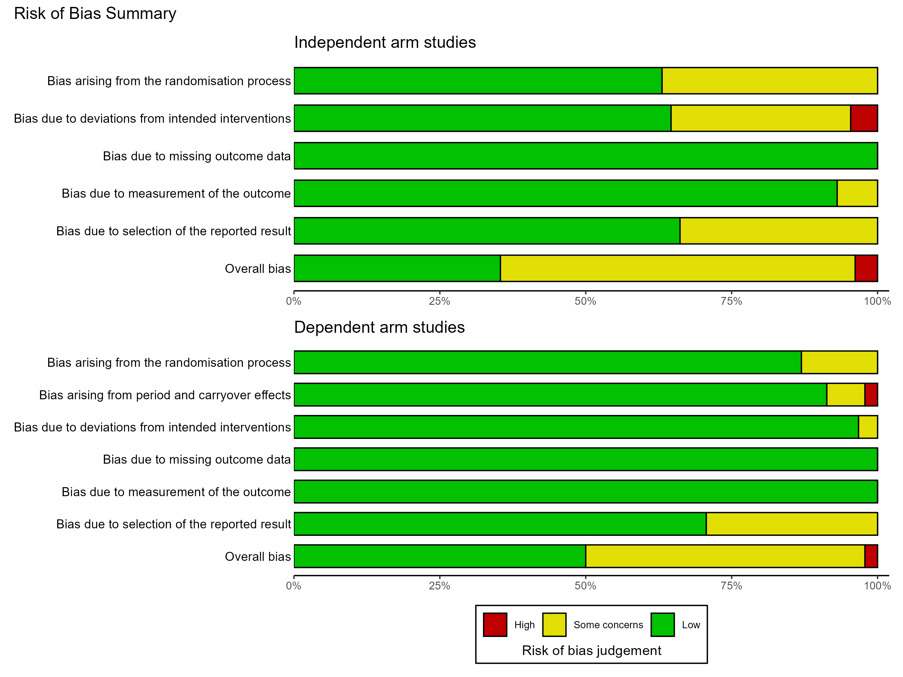

# Introduction

Physical activities, particularly bouts of exercise or sporting activity, are inherently fatiguing (i.e., performance capacity is reduced for a period of time after the activity) and sometimes damaging (i.e., can result in inflammation and structural disruption of tissues). Recovery from bouts of such activities and methods to accelerate it are therefore of considerable importance. This applies to a range of individuals, both with respect to managing training/exercise in addition to sporting performance, or even activities of daily living. The assessment of recovery is often done by comparing performance, perceptual, and biochemical variables as indicators of fatigue and damage before and after a fatiguing exercise bout [@dupuyEvidencebasedApproachChoosing2018]. Performance measures such as countermovement jump height, peak torque during isokinetic dynamometry, and sprint times have been used to monitor neuromuscular fatigue by assessing the decrement, or lack thereof, in performance [@beavenIntermittentLowerlimbOcclusion2012; @williamsEffectLowerLimb2018; @zihanEffectsDifferentIschemic2025]. Perceptual variables such as delayed-onset muscle soreness, rating of perceived exertion, and pain scales are often used to assess a performer’s perception of their recovery and well-being [@dupuyEvidencebasedApproachChoosing2018]. Biochemical markers such as creatine kinase and interleukin-6 can also be measured and are thought to assess the extent of muscle damage and inflammation, respectively, after exercise; reductions in these markers may indicate improved recovery [@dupuyEvidencebasedApproachChoosing2018; @daabBriefCyclesLowerlimb2021]. These methods are commonly used to examine and compare the numerous recovery methods available, aiming to quantify efficacy.

Recovery methods can be classified as either active or passive. Active recovery encompasses all methods that involve physical activity, usually at a lower intensity of effort than the fatiguing activity bout, such as exercise, and typically aims to stretch or gently exercise the muscles to increase blood flow, oxygen delivery, and the removal of waste products [@dupontPerformanceShortIntermittent2003]. Passive recovery refers to methods that do not involve physical activity, including mechanical methods of manipulating tissues such as blood flow restriction, compression garments, and massage; thermal methods including cold exposure (e.g., cold-water immersion and cryotherapy), heat therapy (e.g., saunas and heat packs), or contrast therapy involving alternation of cold and heat therapies; and nutritional interventions, including dietary manipulation and/or supplementation.

While previous systematic reviews have assessed the efficacy of one or more of these modalities, there has been no evidence synthesis using quantitative methods to compare efficacy across these methods, as well as against non-intervention control (i.e., time) or placebo conditions. This highlights the need for an updated systematic review and meta-analysis. Therefore, the aim of this systematic review and meta-analysis was to investigate common post-exercise recovery modalities and assess their comparative efficacy.

# Methods

This systematic review and meta-analysis follows the Preferred Reporting Items for Systematic Reviews and Meta-Analyses (PRISMA) guidelines [@pagePrisma2020Statement2021]. Pre-registration was completed via the [Open Science Framework](https://osf.io/qkpbm/overview).

## Eligibility Criteria

Studies were included if they were randomised between- or within-participant trials that investigated healthy adult populations (age ≥18 years) performing a fatiguing and/or damaging exercise bout with recovery assessed post-exercise. Studies were excluded if they investigated children, animals, or populations with a specified disease or illness. Other exclusion criteria were if the recovery method was used before or during the exercise protocol, or if the study did not take baseline measurements prior to exercise. An initial scoping review led to the selection of the following interventions for inclusion: active recovery, massage, compression garments, blood flow restriction, cold therapies, heat therapies, contrast therapies, and nutrition. Accepted comparators were any non-intervention control or placebo conditions. The outcomes analysed in this review were performance, perceptual, or biochemical measures taken before and after the exercise bout. Further inclusion criteria required that studies have an English-language version available and report quantitative data sufficient to compute effect sizes for recovery from the pre-exercise baseline following the exercise bout.

## Search Strategy

A systematic literature search was conducted by one researcher (BC) across three electronic databases: PubMed, SPORTDiscus, and Web of Science. The databases were selected for their accessibility to researchers and their reputation as sources of information in sport science and human health. The most recent search was carried out on 17 February 2025. The following search string was compiled using the inclusion criteria and used in each database, with punctuation and Boolean language adjusted to fit each database search format:

> ("Recovery" OR "Post Exercise" OR "After Exercise" OR "Fatigue" OR "Delayed Onset Muscle Soreness") AND ("Blood Flow Restriction" OR "Ischemic Conditioning" OR "Active Recovery" OR "Stretching" OR "Compression Garments" OR "Nutrition" OR "Cold Therapy" OR "Contrast Therapy" OR "Massage" OR "Heat Therapy")

Searches were filtered for English-language texts. Results were exported as CSV files and uploaded to Rayyan (Rayyan Systems Inc., USA) [@harrisonSoftwareToolsSupport2020]. Using Rayyan’s automated duplicate detector, the similarity threshold was set to 97%, and papers that met this criterion were removed. Any additional papers with high similarity scores were resolved manually, and any remaining duplicates were removed.

## Selection Process

The first screening process involved reviewing the titles and abstracts of all papers and was completed by two independent researchers (BC and LB). This process removed irrelevant papers based on the inclusion criteria. Any disagreements were discussed and resolved after reviewing these criteria. The remaining studies were sought as full texts through the aforementioned databases, Google Scholar, and the university library catalogue. Any papers that were not open access were requested via inter-library loans. PDFs of each paper were then uploaded to Rayyan for full-text screening. Thereafter, one researcher (BC) completed the full-text screening process, where the eligibility criteria were assessed for each text. During this process, it became evident that papers in the nutrition category exhibited high heterogeneity in design and in the specific diet or supplementation used, so they were excluded as a modality category from the meta-analysis but included in the systematic review. Papers that did not report data sufficient for the computation of effect sizes (e.g., raw means and variances for each outcome and time point) were labelled as “missing data” and neither included nor excluded until the data collection process was complete.

## Data Collection Process

Data extraction from the included papers was completed by one researcher (BC), using a data-extraction sheet in Microsoft Excel (version 16.101.1). Outcomes were coded into three categories: performance, biochemical, and perceptual, because specific outcome operationalisations varied widely across studies. Performance variables were also coded as power, speed, flexibility, agility, or strength, although performance outcomes were meta-analysed as a whole. Perceptual variables were further defined as recovery or soreness, and biochemical variables as damage markers or lactate; each was meta-analysed within its higher-level outcome grouping. The specific tests used to assess each variable were recorded, and all outcome data were recorded at each available time point, with time coded in hours. Participant information, including sample size and mean age, was also extracted. Where otherwise eligible studies included recovery methods outside the scope of the review, only data from interventions of interest were extracted. Missing outcome data were sought from corresponding authors using the email template from Moreau and Gamble [@moreauConductingMetaanalysisAge2022]. Some papers listed inactive email addresses; although efforts were made to find current contact information, not all authors were contactable. Any data received were added to the extraction sheet, after which a second researcher (JS) conducted a confirmatory sample to check data entry.

## Synthesis Methods

Statistical analysis was performed in R (version 4.5.2; R Core Team, <https://www.r-project.org/>) and RStudio (version 2026.01.1; Posit, <https://posit.co/>). All data, code, packages, and the pipeline used for data preparation and analysis are available on the project’s [Open Science Framework page](https://osf.io/y275k/overview) and corresponding [GitHub repository](https://github.com/jamessteeleii/exercise_recovery_modalities_meta). Although pre-registered, the present analysis is considered exploratory and aimed at effect estimation within a Bayesian meta-analytic framework. For all analyses, model estimates and their precision, along with conclusions based on them, are interpreted continuously and probabilistically, considering data quality, plausibility of effect, and previous literature within the context of each model.

## Effect Sizes

Pre- (i.e., rested) to post-exercise effect sizes were calculated within each condition for each outcome using Becker’s *d* [@beckerSynthesizingStandardizedMean1988], where the mean for each post-exercise time point is expressed relative to the pre-exercise mean (i.e., post- minus pre-exercise) and this difference is standardised to the pre-exercise standard deviation. Negative values therefore reflect decrements in the outcome relative to pre-exercise (i.e., fatigue), with zero reflecting recovery to the pre-exercise value. For perceptual outcomes, deviating from our pre-registration, we standardised using pooled standard deviations across time points and heteroscedastic population variances [@bonettConfidenceIntervalsStandardized2008], given that many perceptual outcomes had approximately zero variance at pre-exercise.

## Meta-Analysis Model

An arm-based multiple-treatment-comparison (i.e., network-type) meta-regression model was used because multiple recovery modalities were examined and the included studies investigated one or more different modalities with differing numbers of post-exercise measurements at different time points. This data structure precludes synthesis in a typical contrast-based network meta-analysis, where data are limited to effect sizes for paired contrasts between arms at particular time points and, thus, to studies in which all arms were measured at the same time points. In arm-based analyses, the data are absolute effects within each arm at each time point, and information is borrowed across studies to estimate both within-condition absolute effects and between-condition relative contrasts.

Data were hierarchical across three levels (outcome variables within arms within studies), so random intercepts were included using implicit nested coding across these levels. We included a fixed effect for time in hours post-exercise; however, the functional form was not specified in the pre-registration. Given the exploratory and estimation-based nature of the analysis, effects were allowed to be described by a smooth function of time using thin-plate splines. In addition to the main fixed effect of time, a factor-smooth interaction between time and recovery modality produced a separate smooth function for each recovery modality. Uncorrelated linear random slopes were also included for time and for the interaction of time and recovery modality within study, and for time within arm. Because only randomised trials were included, we assumed that post-exercise, but before beginning each recovery modality, each condition belonged to the same population; therefore, a fixed simple effect for recovery modality (i.e., different intercepts) was not included. Due to model complexity, and the general lack of overall effects for any recovery modality, no additional exploratory analyses of interactions with specific outcomes were performed. Instead, outcomes were categorised into three broad domains and a separate model was fitted for performance, biochemical, and perceptual outcomes.

As noted in the pre-registration, the functional form was not known in advance and clear prior information based on previous empirical data was unavailable. Caution is also required when setting priors for meta-analyses so that information from studies included in the likelihood is not double counted. We therefore used weakly regularising priors set sufficiently wide to allow the data to be the primary influence. Priors for all population-level parameters were Student *t* distributions with 3 degrees of freedom, centred at zero, and with a scale of 2.5.

Results are presented as global grand-mean predicted values over time for ranges in which observations were present within each modality. We also focus on comparisons between recovery modalities and the reference of non-intervention control over time to determine whether any recovery modality outperformed non-intervention control in terms of recovery. All models were run with 2,000 warm-up and 6,000 sampling iterations across four Markov chains. Trace plots and $\hat{R}$ plots were used to examine convergence (all $\hat{R}<1.05$ and most $\hat{R}<1.01$), together with posterior predictive checks to understand the model-implied distributions (see the [diagnostic plots](https://jamessteeleii.github.io/exercise_recovery_modalities_meta/plots/diagnostic_plots.html)).

## Risk of Bias Assessment

Risk of bias was assessed using the Cochrane Risk of Bias 2 (RoB 2) tool [@sterneRob2Revised2019]. The appropriate version was selected according to study design: the standard RoB 2 tool for independent-group randomised trials or the version adapted for crossover/repeated-measures designs. Assessments were completed using the full-text PDFs collated during full-text screening. Each study was evaluated across the relevant RoB 2 domains, with domain-level judgements contributing to an overall risk-of-bias judgement.

# Results

## Study Selection

The database searches identified 2,713 articles, of which 967 duplicates and a further 1,473 articles were excluded based on titles and abstracts during initial screening (@fig-prisma). The remaining 261 articles were assessed via full-text screening, resulting in the exclusion of 200 articles based on the eligibility criteria. A total of 61 studies and 1,194 participants (mean age = 24.16 ± 5.26 years) were included in the review. Of the included articles, 11 assessed nutrition (@tbl-nutrition), 25 investigated cold-water immersion (@tbl-cold-therapy), five used contrast-therapy protocols and three included heat therapy (@tbl-heat-contrast), seven investigated blood-flow restriction (@tbl-blood-flow-restriction), six studied compression garments (@tbl-compression), two studied massage, and seven used active recovery (@tbl-active-massage).

{#fig-prisma fig-alt="PRISMA flow diagram for study identification, screening, eligibility, and inclusion." width=85%}

## Risk of Bias

The summary of the risk-of-bias assessment is shown in @fig-rob2. Whilst individual domains typically showed “Low” risk of bias in isolation, at least half of all dependent-arm studies and more than half of all independent-arm studies were classified overall as either having “Some concerns” or “High” risk of bias.

{#fig-rob2 fig-alt="Stacked bar charts showing RoB 2 domain and overall judgements for independent-arm and dependent-arm studies." width=95%}

## Performance Outcomes

The model examining performance outcomes included 38 studies containing 72 separate arms reporting 654 within-arm effects. The recovery-modality conditions comprised 27 control, 10 placebo, 11 active recovery, 7 blood-flow restriction, 26 cold, 3 heat, 4 contrast, 6 compression, and 2 massage arms. Global grand-mean estimates for both predicted values and contrasts against non-intervention control are shown in @fig-performance. Across all modalities, performance recovered to pre-exercise values by approximately 72–120 hours post-exercise, with no modality showing clearly better recovery than non-intervention control.

{#fig-performance fig-alt="Faceted predictions and contrasts over time for performance outcomes by recovery modality." width=100%}

## Biochemical Outcomes

The model examining biochemical outcomes included 29 studies containing 58 separate arms reporting 312 within-arm effects. The recovery-modality conditions comprised 20 control, 7 placebo, 7 active recovery, 3 blood-flow restriction, 23 cold, 1 heat, 4 contrast, 6 compression, and 1 massage arm. Global grand-mean estimates for both predicted values and contrasts against non-intervention control are shown in @fig-biochemical. Across all modalities, biochemical markers did not begin to recover until after approximately 24 hours post-exercise and had not clearly returned to pre-exercise values by approximately 120 hours post-exercise. No modality resulted in clearly better recovery than non-intervention control.

{#fig-biochemical fig-alt="Faceted predictions and contrasts over time for biochemical outcomes by recovery modality." width=100%}

## Perceptual Outcomes

The model examining perceptual outcomes included 32 studies containing 63 separate arms reporting 336 within-arm effects. The recovery-modality conditions comprised 24 control, 8 placebo, 9 active recovery, 5 blood-flow restriction, 22 cold, no heat conditions (because the single study provided insufficient data to calculate an effect size), 5 contrast, 6 compression, and 1 massage arm. Global grand-mean estimates for both predicted values and contrasts against non-intervention control are shown in @fig-perceptual. Across all modalities, perceptual outcomes recovered to pre-exercise values by approximately 72–120 hours post-exercise, with no modality showing clearly better recovery than non-intervention control.

{#fig-perceptual fig-alt="Faceted predictions and contrasts over time for perceptual outcomes by recovery modality." width=100%}



# Discussion

The present review examined post-exercise recovery trajectories for perceptual, performance, and biochemical outcomes. The meta-analyses indicated that recovery occurred progressively over time across all conditions and that differences between recovery modalities were generally small with wide uncertainty intervals, with no clear benefit of any modality over non-intervention control. Most outcomes indicative of fatigue or damage recovered over time, with biochemical outcomes appearing to recover more slowly than performance and perceptual measures. The magnitude of differences between modalities was generally modest, suggesting that no single intervention consistently outperformed the others or non-intervention control.

Despite the plausible physiological mechanisms proposed for the recovery modalities investigated, neither active recovery, mechanical methods, nor thermal methods showed clear evidence of benefit over control or placebo conditions. There were also no clear benefits in placebo conditions compared with controls. Whether different modalities merely result in similar recovery due to the general effect of time, or achieve the same recovery through different mechanisms, cannot be elucidated from these results alone. From a practical perspective, assuming all else is equal, including adverse events, the choice of recovery modality can therefore be driven by preference and logistical considerations.

## Nutrition

Although the original intention was to examine nutritional interventions, the heterogeneity of these interventions and the small number of studies led us to omit them from the quantitative synthesis. We identified 11 studies investigating nutritional interventions, of which eight studied post-exercise ingestion of carbohydrates or protein and three investigated other post-exercise supplements. Carbohydrate ingestion can support glycogen replenishment following exercise, suggesting that investigation of the intramuscular environment and glucose may be preferable to traditional recovery-monitoring methods [@naderiNutritionalStrategiesImprove2025]. Protein supplementation after exercise is believed to support muscle growth and repair, but time and rest are also important factors in this process [@alghannamRestorationMuscleGlycogen2018; @cravenEffectConsumingCarbohydrate2021]. Only one study found a positive effect of manipulating macronutrients on performance recovery, measured as muscular strength [@etheridgeSingleProteinMeal2008]. One study reported attenuated perceived soreness following high carbohydrate intake [@saundersProteinSupplementationDuring2018]. The three supplements examined were beetroot juice, grape-seed extract, and ketone monoester. Only beetroot juice attenuated soreness, although decreased creatine kinase was reported after grape-seed extract [@cliffordBeetrootJuiceMore2017; @kimEffectsAcuteGrape2019]. No significant differences were reported between ketone-monoester and placebo groups [@martinarrowsmithKetoneMonoesterSupplementation2020]. Overall, neither manipulation of carbohydrate and protein intake nor supplement use has clear evidence of enhanced recovery, consistent with the general findings of the meta-analysis for other recovery modalities.

## Limitations

One limitation is that the review did not consider differences between single-bout and repeated-use post-exercise recovery methods; repeated use may yield additive effects over time. The review instead investigated protocol efficacy to compare different recovery methods. It also did not include an exhaustive list of recovery methods, focusing on common modalities selected through a scoping search. Although it is unlikely that excluded methods would have had a strong effect given the available evidence, other methods may have a larger impact on post-exercise recovery. Lastly, the study did not investigate differences between populations within each modality. Recovery and comparative effects may differ across performance levels (e.g., sedentary, recreationally active, trained, or elite athletes). For example, recovery may be accelerated among those already accustomed to exercise through the repeated-bout effect, and comparative effects of recovery modalities may differ accordingly [@naderiNutritionalStrategiesImprove2025; @bieuzenContrastWaterTherapy2013; @ahokasEffectsPostexerciseHeat2025].

## Practical Implications

Coaches and athletes must consider several factors when selecting a recovery technique. Because no recovery modality clearly outperformed another, other factors should determine whether a technique is used. Individual preference may be relevant independently of whether a modality is more efficacious than no recovery modality. Accessibility and practicality are also important. In contexts involving long-distance travel between fixtures, techniques may need to be performed in small spaces or with limited time and personnel, making some modalities more or less appropriate. The cost of recovery modalities should also be considered relative to their actual or perceived benefits.

## Conclusion

The dominant factor in recovery appears to be time rather than any single intervention. None of the included recovery modalities exhibited strong or certain effects on any recovery domain over and above non-intervention control. Most included studies had some associated risk of bias. Inconsistent protocols and limited evidence for many techniques make current findings uncertain and highlight the need for further investigation. Future research should consider head-to-head comparisons of different modalities and clarify best-practice protocols using pre-registered, rigorous experimental designs with high power and precision. It may also be useful to examine evidence of individual heterogeneity in effects using variance-comparison approaches or randomised replicated crossover designs, because the present results concern average intervention effects. Lastly, the mechanisms of post-exercise recovery, whether due to time generally or to specific modalities that are subsequently shown to have meaningful effects, require further elucidation. For those considering post-exercise recovery protocols, individual preference and accessibility remain important. Across modalities and domains, the present findings suggest that time remains the primary driver of post-exercise recovery.

# Declarations {.unnumbered}

## Conflicts of Interest {.unnumbered}

This review was conducted by BC as part of a PhD thesis funded by Hytro, a recovery technology company. Although none of the studies included in this review directly investigated Hytro products, two authors (TB and WB) have affiliations with Hytro; WB is a co-founder of Hytro, and TB serves as Chief Scientific Officer. JS is currently contracted by MacroFactor, a company that produces a nutrition-tracking app, and by the MacroFactor Foundation. He has also received travel expenses and honoraria for speaking from fit20 International, Exercise School Portugal, and Discover Strength, and provides research consultancy through his company Steele Research Limited. A full declaration of interest for JS is available through his website ([https://steele-research.com/declaration-of-interests/](https://steele-research.com/declaration-of-interests/)).

No additional funding was received for the conduct of this review nor are there any other conflicts of interest to declare.

## Data and Code Availability {.unnumbered}

The data, code, package lockfile, and analysis pipeline are available through the project’s [Open Science Framework page](https://osf.io/y275k/overview) and [GitHub repository](https://github.com/jamessteeleii/exercise_recovery_modalities_meta).
